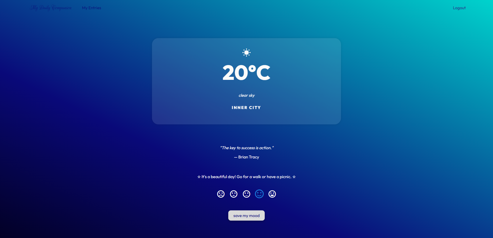

# 🌤️ Mood Tracker

> **This project was created as part of the _System Integration_ lecture in the Master's program.**

A full-stack application that helps users track their mood based on the current weather.  
The app consists of a **Vue.js frontend** and a **Node.js + Express.js backend**, connected to a PostgreSQL database.

---

## 🚀 Features

✅ Record your mood alongside local weather  
✅ View past mood entries  

---

## 🖼️ Screenshots

### 📌 Mood Entry Form

---

## 🛠️ Tech stack

- **Frontend:** Vue.js
- **Backend:** Node.js, Express.js
- **Database:** PostgreSQL

